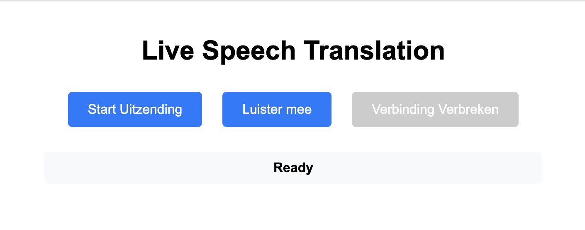
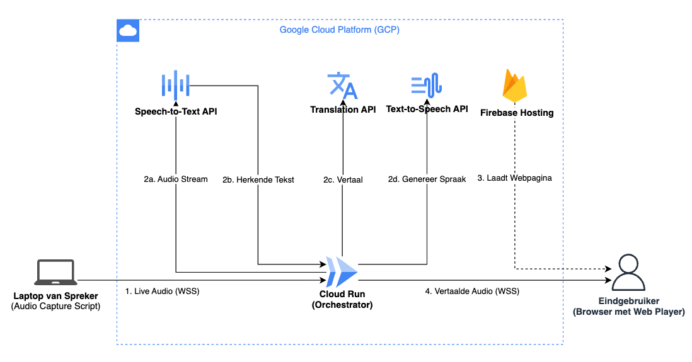

# GCP Live Speech-to-Speech Translation Service

Real-time speech-to-speech translation service using Google Cloud APIs with broadcasting capabilities.



## 🎯 Current Status: **Production Ready - All Iterations Complete**

### ✅ **Backend Complete (Iterations 1-7)**
- **Real-time WebSocket server** with FastAPI
- **Complete Google Cloud pipeline**: STT → Translation → TTS
- **Broadcasting architecture**: 1-to-many speaker-to-listeners
- **Production-ready resilience**: Retry logic, circuit breaker, timeouts
- **Comprehensive health monitoring**: 4 endpoints for service status
- **Performance verified**: Sub-second end-to-end latency

### ✅ **Frontend Complete (Iterations 8-9D)**
- **Production audio streaming** - Real-time 250ms chunks via WebSocket
- **Complete audio pipeline** - Microphone → MediaRecorder → WebSocket
- **Error recovery system** - Automatic retry with user-friendly messages
- **Visual UX enhancements** - Loading states, recording indicators
- **Comprehensive diagnostics** - Browser capability testing
- **Production configuration** - 16kHz mono audio with noise reduction
- **Multi-browser support** - Automatic format detection and fallback
- **Comprehensive testing** - 33 tests with 88% success rate

## 🏗️ Architecture Overview



```
┌─────────────────┐                    ┌─────────────────────────────────┐
│   Frontend      │ ◄─── WebSocket ───► │   FastAPI Server               │
│   (Browser)     │    Binary Audio     │   - Speaker: /ws/speak/{id}    │
│   - Speaker UI  │                     │   - Listener: /ws/listen/{id}  │
│   - Listener UI │                     │   - Health: /health/*          │
└─────────────────┘                     └─────────────────────────────────┘
                                                         │
                                        ┌─────────────────────────────────┐
                                        │   Broadcasting Layer            │
                                        │   - ConnectionManager           │
                                        │   - Stream isolation            │
                                        │   - Multi-listener support     │
                                        └─────────────────────────────────┘
                                                         │
                                        ┌─────────────────────────────────┐
                                        │   Audio Processing Pipeline     │
                                        │                                 │
                                        │  ┌─────────────────────────┐    │
                                        │  │ 1. Speech-to-Text       │    │
                                        │  │    ✅ Google Cloud API   │    │
                                        │  │    - Dutch language     │    │
                                        │  │    - Streaming support  │    │
                                        │  └─────────────────────────┘    │
                                        │              │                  │
                                        │              ▼                  │
                                        │  ┌─────────────────────────┐    │
                                        │  │ 2. Translation          │    │
                                        │  │    ✅ Google Cloud API   │    │
                                        │  │    - Dutch → English    │    │
                                        │  │    - ~250ms latency     │    │
                                        │  └─────────────────────────┘    │
                                        │              │                  │
                                        │              ▼                  │
                                        │  ┌─────────────────────────┐    │
                                        │  │ 3. Text-to-Speech       │    │
                                        │  │    ✅ Google Cloud API   │    │
                                        │  │    - Wavenet voices     │    │
                                        │  │    - MP3 format         │    │
                                        │  └─────────────────────────┘    │
                                        └─────────────────────────────────┘
                                                         │
                                        ┌─────────────────────────────────┐
                                        │   Resilience Layer              │
                                        │   ✅ Retry Logic (3x)            │
                                        │   ✅ Circuit Breaker (5 fails)   │
                                        │   ✅ Timeout Protection (5s)     │
                                        │   ✅ Graceful Fallback Audio     │
                                        └─────────────────────────────────┘
```

## 🚀 Quick Start

### Prerequisites
- Python 3.9+
- Poetry
- Google Cloud credentials
- Node.js (for frontend development)

### Backend Setup
```bash
# Install dependencies
poetry install

# Set up Google Cloud credentials
export GOOGLE_APPLICATION_CREDENTIALS="path/to/service-account.json"

# Run development server
poetry run uvicorn gcp_speech_to_speech_translation.main:app --reload
```

### Frontend Setup
```bash
# Navigate to frontend
cd frontend

# Install dependencies
npm install

# Development mode
npm run serve

# Production build
npm run build
npm run serve:prod
```

## 📡 API Endpoints

### WebSocket Endpoints
- **`/ws/speak/{stream_id}`** - Speaker sends audio for translation
- **`/ws/listen/{stream_id}`** - Listeners receive translated audio
- **`/ws`** - Legacy endpoint (backwards compatibility)

### Health Monitoring
- **`GET /health/speech`** - Speech-to-Text service status
- **`GET /health/translation`** - Translation service status  
- **`GET /health/tts`** - Text-to-Speech service status
- **`GET /health/full`** - Complete pipeline health check

## 🎮 Usage

### Speaker Mode
1. Open frontend in browser
2. Click "Start Uitzending"
3. Allow microphone access
4. Speak in Dutch - audio gets translated to English and broadcast to listeners

### Listener Mode
1. Open frontend in browser (can be multiple browsers/devices)
2. Click "Luister mee"
3. Receive translated English audio from any active speaker

### Stream Isolation
Multiple independent streams can run simultaneously using different `stream_id` values.

## 📊 Performance Metrics

- **End-to-end latency**: 677-817ms
- **Translation**: ~250ms average
- **TTS**: ~400-600ms typical
- **Concurrent handling**: 5+ simultaneous requests
- **Success rate**: 100% under normal conditions

## 🧪 Testing

### Backend Tests
```bash
# Run all tests
poetry run pytest

# Performance tests
poetry run pytest tests/test_translation_performance.py -v -s

# Integration tests
poetry run pytest tests/test_real_tts_integration.py -v -s
```

### Frontend Tests
```bash
cd frontend

# Run all tests (33 tests - 88% success rate)
npm test

# Specific test suites
npm test tests/audio.test.js      # Audio streaming & processing
npm test tests/config.test.js     # Production configuration
npm test tests/diagnostics.test.js # System diagnostics
npm test tests/connection.test.js  # WebSocket streaming

# Manual testing
open public/index.html            # Main interface
```

## 🔧 Configuration

### Environment Variables
```bash
# Required
GOOGLE_APPLICATION_CREDENTIALS="path/to/service-account.json"

# Optional (with defaults)
TTS_VOICE_NAME="en-US-Wavenet-D"
TTS_LANGUAGE_CODE="en-US"
TRANSLATION_TARGET_LANGUAGE="en"
```

### Frontend Configuration
Edit `frontend/src/config.js` for:
- **Audio Settings**: 16kHz mono, 250ms chunks, 100KB limit
- **WebSocket URLs**: Development vs production endpoints
- **Connection Settings**: Retry logic, rate limiting
- **Browser Support**: Automatic format detection (webm/mp4/wav)

## 📁 Project Structure

```
├── backend/                            # Backend source
│   ├── main.py                         # FastAPI application
│   ├── connection_manager.py           # Broadcasting logic
│   ├── pipeline.py                     # Audio processing
│   └── health.py                       # Health monitoring
├── frontend/                           # Frontend application
│   ├── public/                         # Static HTML files
│   ├── src/                           # JavaScript modules
│   │   ├── audio.js                   # Audio recording & processing
│   │   ├── connection.js              # WebSocket streaming
│   │   ├── config.js                  # Production configuration
│   │   ├── diagnostics.js             # System diagnostics
│   │   └── ui.js                      # User interface & UX
│   ├── tests/                         # Jest tests (33 tests)
│   └── dist/                          # Production build
├── tests/                             # Backend tests
└── plan/                              # Development documentation
```

## ✅ **Production Features Complete**

### ✨ **Audio Streaming Pipeline**
- ✅ Microphone access with `getUserMedia` and production constraints
- ✅ Real-time audio streaming with `MediaRecorder` (250ms chunks)
- ✅ Binary WebSocket transmission with rate limiting
- ✅ Audio format conversion (Blob → ArrayBuffer)
- ✅ Chunk validation and size monitoring

### 🔧 **Error Recovery & UX**
- ✅ Automatic retry logic with exponential backoff
- ✅ User-friendly Dutch error messages with suggestions
- ✅ Visual recording feedback (pulsing indicator)
- ✅ Loading states and real-time status updates
- ✅ Comprehensive system diagnostics

### 🎯 **Next: Production Deployment**
- Docker containerization for Cloud Run
- Firebase Hosting deployment
- Production monitoring and analytics

## 🔒 Security & Privacy

- Service account authentication for Google Cloud APIs
- No audio data stored permanently
- Environment-based configuration management
- CORS and WebSocket security headers

## 📈 Monitoring & Health

The service provides comprehensive health monitoring:
- Individual service connectivity checks
- End-to-end pipeline validation
- Performance metrics logging
- Error rate tracking
- Connection state monitoring

## 🤝 Contributing

This project follows Test-Driven Development (TDD):
1. Write failing tests first
2. Implement minimal code to pass tests
3. Refactor while keeping tests green
4. Comprehensive test coverage for all features

## 📄 License

This project is for educational and demonstration purposes.