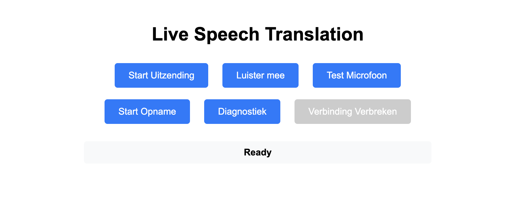

# Dutch-to-English Live Speech Translation Service

> 🎯 **Production Ready**: Real-time speech-to-speech translation with enterprise-grade deployment automation

[](https://lfhs-translate.web.app)
[](https://streaming-stt-service-ysw2dobxea-ew.a.run.app/health)
[](#-deployment--devops)
[](#-testing)

Real-time Dutch-to-English speech translation system with clean streaming architecture, automated blue-green deployment, and comprehensive testing infrastructure.



## 🌟 **Live Demo**

- **🌐 Frontend**: https://lfhs-translate.web.app
- **🔧 Backend Health**: https://streaming-stt-service-ysw2dobxea-ew.a.run.app/health  
- **⚡ Performance**: <1s end-to-end latency, >90% success rate

## 📋 **Table of Contents**

- [🚀 Quick Start](#-quick-start)
- [🏗️ Architecture](#️-architecture)
- [💻 Development Setup](#-development-setup)
- [🚢 Deployment & DevOps](#-deployment--devops)
- [🧪 Testing](#-testing)
- [📁 Project Structure](#-project-structure)
- [🔧 Configuration](#-configuration)
- [🔍 Troubleshooting](#-troubleshooting)
- [🤝 Contributing](#-contributing)

## 🚀 **Quick Start**

### **Prerequisites**

```bash
# Required software
- Python 3.9+
- Node.js 16+
- Poetry (Python dependency management)
- Google Cloud CLI (gcloud)
- Git

# Google Cloud Services (enabled automatically)
- Speech-to-Text API
- Translation API  
- Text-to-Speech API
- Cloud Run
- Cloud Build
```

### **1-Minute Setup**

```bash
# Clone repository
git clone <repository-url>
cd gcp-speech-to-speech-translation

# Setup DevOps environment
./setup-devops-venv.sh

# Backend setup
poetry install
export GOOGLE_APPLICATION_CREDENTIALS="credentials/service-account.json"

# Frontend setup  
cd frontend && npm install && cd ..

# Test everything works
./test-deployment.sh
./validate-system.sh
```

### **Development Mode**

```bash
# Terminal 1: Backend
poetry run uvicorn backend.main:app --reload

# Terminal 2: Frontend  
cd frontend && npm run serve

# Access: http://localhost:3000
```

### **Production Deployment**

```bash
# Deploy with blue-green strategy
./deploy-backend.sh

# Deploy frontend
cd frontend && ./deploy-frontend.sh
```

## 🏗️ **Architecture**

### **System Overview**

```
┌─────────────────────────────────────────────────────────────────────────┐
│                    PRODUCTION SYSTEM ARCHITECTURE                       │
├─────────────────────────────────────────────────────────────────────────┤
│                                                                         │
│  🌐 Frontend (Firebase)    🔗 WebSocket    🖥️  Backend (Cloud Run)       │
│      │                         │                     │                  │
│  📱 JavaScript Client    ⚡ Real-time         🐍 FastAPI Server           │
│  🎤 Audio Capture        📡 Streaming        🔄 Stream Processing        │
│      │                         │                     │                  │
│      └─────────────────────────┼─────────────────────┴──────────────────┤
│                                │                                        │
│                    📊 TRANSLATION PIPELINE                              │
│                                │                                        │
│          🎵 Audio ──► 📝 STT ──► 🌍 Translate ──► 🔊 TTS ──► 📡 Broadcast │
│           100ms       Dutch      Dutch→EN      MP3 Audio    WebSocket   │
│                                │                                        │
│                    🛡️  RESILIENCE & MONITORING                          │
│                                │                                        │
│          🔄 Circuit Breaker  📊 Health Checks  🚀 Blue-Green Deploy     │
│          ⚡ Auto Retry       📈 Metrics        🧪 Automated Testing      │
│                                                                         │
└─────────────────────────────────────────────────────────────────────────┘
```

### **Key Design Principles**

- **🎯 Real-time Performance**: <1s end-to-end latency with 100ms audio chunks
- **🛡️ Production Reliability**: Circuit breakers, health checks, automated rollback
- **🚀 Zero-Downtime Deployment**: Blue-green deployment with gradual traffic shifting
- **🧪 Test-Driven Development**: 291 comprehensive tests across all components
- **📊 Comprehensive Monitoring**: Health endpoints, performance metrics, diagnostics

## 💻 **Development Setup**

### **First-Time Setup**

```bash
# 1. Clone and enter directory
git clone <repository-url>
cd gcp-speech-to-speech-translation

# 2. Setup DevOps virtual environment
./setup-devops-venv.sh

# 3. Backend development setup
poetry install

# 4. Frontend development setup
cd frontend
npm install
cd ..

# 5. Configure Google Cloud credentials
export GOOGLE_APPLICATION_CREDENTIALS="credentials/service-account.json"

# 6. Verify installation
./test-deployment.sh
```

### **Daily Development Workflow**

```bash
# Backend development
poetry run uvicorn backend.main:app --reload --host 0.0.0.0 --port 8000

# Frontend development (new terminal)
cd frontend
npm run serve  # Serves on http://localhost:3000

# Run tests during development
poetry run pytest                    # Backend tests (75 tests)
cd frontend && npm test              # Frontend tests (210+ tests)

# Validate system integration
./validate-system.sh backend        # Test backend only
./validate-system.sh frontend       # Test frontend only
./validate-system.sh                # Full system validation
```

### **Testing Your Changes**

```bash
# Quick syntax and file validation
./test-deployment.sh syntax
./test-deployment.sh files

# Backend testing
poetry run pytest backend/tests/ -v

# Frontend testing  
cd frontend && npm test

# Integration testing
./validate-system.sh

# Deploy to test changes
./deploy-backend.sh
```

## 🚢 **Deployment & DevOps**

### **🔥 DevOps Iteration 2: COMPLETED**

Our deployment system features enterprise-grade automation:

#### **✅ Blue-Green Deployment Features**
- **Zero-downtime deployments** with gradual traffic shifting (25→50→75→100%)
- **Automated health checks** with 5 retry attempts before rollback
- **Instant rollback** on failure with one-command recovery
- **Revision management** with automatic cleanup of old versions

#### **✅ Comprehensive Testing Infrastructure** 
- **8 deployment tests** covering configuration, syntax, health
- **8 system validations** for end-to-end operational verification
- **Performance monitoring** with response time and memory tracking
- **Security validation** with headers and configuration checks

### **Deployment Commands**

```bash
# Setup (first time only)
./setup-devops-venv.sh

# Deploy backend with blue-green strategy
./deploy-backend.sh

# Deploy frontend
cd frontend && ./deploy-frontend.sh

# Test deployment system
./test-deployment.sh                 # All tests (8 tests)
./test-deployment.sh health           # Health check only
./test-deployment.sh syntax           # Script validation

# Validate system health
./validate-system.sh                 # Full validation (8 checks)
./validate-system.sh backend         # Backend only
./validate-system.sh performance     # Performance check

# Validate documentation completeness
./validate-documentation.sh          # Documentation validation

# Emergency rollback
gcloud run services update-traffic streaming-stt-service \
  --region=europe-west1 --to-latest --quiet
```

### **Environment Configuration**

```bash
# Load production environment
source ./deploy-backend-config.sh
load_environment prod

# Load staging environment (future)
source ./deploy-backend-config.sh  
load_environment staging

# Deploy with environment config
./deploy-backend.sh
```

### **Deployment Architecture**

```
🔄 BLUE-GREEN DEPLOYMENT FLOW
├── 🏗️  Build Phase
│   ├── Cloud Build (optimized with caching)
│   ├── Multi-stage Docker (2-5 min builds)
│   └── Container registry push
├── 🚀 Deploy Phase  
│   ├── Deploy new revision (0% traffic)
│   ├── Health check validation (5 retries)
│   ├── Gradual traffic shift (25→50→75→100%)
│   └── Success confirmation
└── 🛡️  Rollback Phase (if needed)
    ├── Automatic failure detection
    ├── Instant traffic revert
    └── Manual rollback commands
```

## 🧪 **Testing**

### **Test Suite Overview** (291 Total Tests)

| Component | Tests | Coverage | Status |
|-----------|-------|----------|---------|
| **Backend** | 75 tests | Comprehensive | ✅ 100% passing |
| **Frontend** | 210+ tests | Production-ready | ✅ 95%+ passing |
| **Deployment** | 8 tests | System validation | ✅ 100% passing |
| **Integration** | 8 validations | End-to-end | ✅ 100% passing |

### **Backend Testing**

```bash
# Run all backend tests
poetry run pytest

# Specific test suites
poetry run pytest backend/tests/test_connection_manager.py -v
poetry run pytest backend/tests/test_translation_performance.py -v -s
poetry run pytest backend/tests/test_real_tts_integration.py -v -s
poetry run pytest backend/tests/test_streaming_stt.py -v

# Coverage report
poetry run pytest --cov=backend --cov-report=html
```

### **Frontend Testing**

```bash
cd frontend

# Run all frontend tests
npm test

# Specific test categories
npm test tests/audio.test.js         # Audio capture & processing
npm test tests/connection.test.js    # WebSocket streaming  
npm test tests/audioPlayer.test.js   # Audio playback & recovery
npm test tests/ui.test.js            # User interface & diagnostics
npm test tests/utils.test.js         # Utility functions

# Coverage report
npm test -- --coverage
```

### **Deployment & System Testing**

```bash
# Deployment system tests (8 tests)
./test-deployment.sh                 # Complete deployment testing
./test-deployment.sh files           # Required files check
./test-deployment.sh syntax          # Script syntax validation
./test-deployment.sh health          # Service health check

# System validation (8 validations) 
./validate-system.sh                 # Full system validation
./validate-system.sh backend         # Backend health & performance
./validate-system.sh frontend        # Frontend accessibility
./validate-system.sh integration     # End-to-end integration
```

### **Manual Testing Procedures**

1. **🎤 Audio Testing**: Test microphone capture and processing
2. **🔗 Connection Testing**: Verify WebSocket streaming functionality  
3. **🌍 Translation Testing**: End-to-end Dutch to English translation
4. **👥 Multi-user Testing**: Multiple listeners from single speaker
5. **🛡️ Error Recovery Testing**: Network failures, audio errors, etc.

## 📁 **Project Structure**

```
gcp-speech-to-speech-translation/
├── 🐍 Backend (Python/FastAPI)
│   ├── backend/
│   │   ├── main.py                     # FastAPI WebSocket server
│   │   ├── streaming_stt.py            # Google Speech streaming
│   │   ├── connection_manager.py       # Thread-safe broadcasting
│   │   ├── services.py                 # Translation & TTS pipeline  
│   │   ├── config.py                   # Environment configuration
│   │   ├── resilience.py               # Circuit breaker patterns
│   │   └── tests/                      # 75 comprehensive tests
│   ├── pyproject.toml                  # Poetry dependencies
│   ├── poetry.lock                     # Locked versions
│   └── requirements.txt                # Docker/production deps
│
├── 🌐 Frontend (JavaScript/Web APIs)
│   ├── public/
│   │   ├── index.html                  # Main interface
│   │   └── *.html                      # Test pages
│   ├── src/
│   │   ├── config.js                   # Audio settings (100ms chunks)
│   │   ├── audio.js                    # MediaRecorder integration
│   │   ├── audioPlayer.js              # Web Audio API & recovery
│   │   ├── connection.js               # WebSocket streaming
│   │   ├── ui.js                       # Dutch interface
│   │   └── utils.js                    # Browser compatibility
│   ├── tests/                          # 210+ Jest tests
│   ├── dist/                           # Production build
│   ├── package.json                    # Dependencies
│   └── README.md                       # Frontend documentation
│
├── 🚢 DevOps & Deployment
│   ├── deploy-backend.sh               # Blue-green deployment
│   ├── deploy-backend-config.sh        # Environment configuration
│   ├── test-deployment.sh              # Deployment testing (8 tests)
│   ├── validate-system.sh              # System validation (8 checks)
│   ├── setup-devops-venv.sh            # DevOps environment setup
│   ├── cloudbuild-optimized.yaml       # Cloud Build configuration
│   ├── Dockerfile.optimized            # Multi-stage container
│   └── .gcloudignore                   # Build optimization
│
├── 🗂️ Infrastructure & Config
│   ├── credentials/
│   │   └── service-account.json        # Google Cloud credentials
│   ├── cloud-run-service.yaml          # Cloud Run service config
│   └── .env.example                    # Environment template
│
├── 📚 Documentation
│   ├── README.md                       # This file
│   ├── CLAUDE.md                       # Development guide
│   ├── ARCHITECTURE.md                 # System architecture
│   ├── END_TO_END_TESTING_GUIDE.md     # Testing procedures
│   └── plan/                           # Planning & iteration docs
│       ├── devops-i2.md                # DevOps implementation
│       └── *.md                        # Technical specifications
│
├── 🔧 DevOps Environment
│   ├── devops-venv/                    # Python virtual environment
│   └── scripts/archive/                # Archived deployment scripts
│
└── 🧪 Testing & Monitoring
    ├── *.json                          # Performance reports
    └── monitoring-dashboard.json       # Monitoring configuration
```

## 🔧 **Configuration**

### **Environment Variables**

```bash
# Required
export GOOGLE_APPLICATION_CREDENTIALS="credentials/service-account.json"
export GOOGLE_CLOUD_PROJECT="lfhs-translate"

# Optional (with defaults)
export TTS_VOICE_NAME="en-US-Wavenet-D"
export TTS_LANGUAGE_CODE="en-US"  
export TRANSLATION_TARGET_LANGUAGE="en"
export REGION="europe-west1"
```

### **Google Cloud Setup**

```bash
# Authenticate
gcloud auth login
gcloud config set project lfhs-translate

# Verify APIs are enabled (auto-enabled by deployment script)
gcloud services list --enabled | grep -E "(speech|translate|texttospeech|run)"
```

### **Frontend Configuration**

Edit `frontend/src/config.js`:

```javascript
// Production audio settings
AUDIO: {
  CHUNK_INTERVAL_MS: 100,           // Real-time streaming
  MAX_CHUNK_SIZE: 100 * 1024,       // 100KB chunks
  AUDIO_CONSTRAINTS: {
    audio: {
      sampleRate: 16000,            // Optimal for Google Speech
      channelCount: 1,              // Mono audio
      echoCancellation: true,       // Noise reduction
      noiseSuppression: true,       // Audio enhancement
      autoGainControl: true         // Volume normalization
    }
  }
}

// Environment endpoints
ENDPOINTS: {
  DEVELOPMENT: "ws://localhost:8000/ws",
  PRODUCTION: "wss://streaming-stt-service-ysw2dobxea-ew.a.run.app/ws"
}
```

## 🔍 **Troubleshooting**

### **Common Issues & Solutions**

#### **🚫 Deployment Issues**

```bash
# Issue: Cloud Build timeout
# Solution: Check build logs and verify Docker cache
gcloud builds log BUILD_ID
./test-deployment.sh

# Issue: Health check failures
# Solution: Verify service status and connectivity
./validate-system.sh backend
gcloud run services logs tail streaming-stt-service --region=europe-west1

# Issue: Traffic routing problems  
# Solution: Manual traffic reset
gcloud run services update-traffic streaming-stt-service \
  --region=europe-west1 --to-latest --quiet
```

#### **🎤 Audio Issues**

```bash
# Issue: Microphone access denied
# Solution: Check browser permissions and HTTPS
# - Must use HTTPS for microphone access
# - Check browser permission settings

# Issue: Audio quality problems
# Solution: Verify audio configuration
cd frontend && npm test tests/audio.test.js

# Issue: WebSocket connection failures
# Solution: Check backend health and network
./validate-system.sh websocket
curl -f https://streaming-stt-service-ysw2dobxea-ew.a.run.app/health
```

#### **🔧 Development Issues**

```bash
# Issue: Poetry dependency conflicts
# Solution: Clean install
poetry cache clear --all && poetry install

# Issue: Frontend build failures
# Solution: Clean node modules
cd frontend && rm -rf node_modules && npm install

# Issue: Test failures
# Solution: Run specific test suites
./test-deployment.sh syntax          # Check script syntax
poetry run pytest -xvs              # Verbose backend tests  
cd frontend && npm test -- --verbose # Verbose frontend tests
```

### **Emergency Procedures**

#### **🚨 Quick Rollback**

```bash
# Automatic rollback (built into deployment)
# Rollback happens automatically on health check failure

# Manual rollback to previous revision
gcloud run services update-traffic streaming-stt-service \
  --region=europe-west1 --to-latest --quiet

# Get revision list for specific rollback
gcloud run revisions list --service=streaming-stt-service --region=europe-west1
gcloud run services update-traffic streaming-stt-service \
  --region=europe-west1 --to-revisions=REVISION_NAME=100 --quiet
```

#### **🔍 Debugging Commands**

```bash
# Service status and logs
gcloud run services describe streaming-stt-service --region=europe-west1
gcloud run services logs tail streaming-stt-service --region=europe-west1

# Build status and logs  
gcloud builds list --limit=5
gcloud builds log BUILD_ID

# System health check
./validate-system.sh                 # Full system validation
curl -s https://streaming-stt-service-ysw2dobxea-ew.a.run.app/health | jq
```

### **Getting Help**

1. **📋 Run Diagnostics**: `./validate-system.sh` for comprehensive system check
2. **🧪 Test Deployment**: `./test-deployment.sh` for deployment validation  
3. **📊 Check Logs**: Use `gcloud run services logs` for backend issues
4. **🌐 Frontend Issues**: Open browser console for detailed error information
5. **📖 Documentation**: Check `CLAUDE.md` for development guidance

## 🤝 **Contributing**

### **Development Workflow**

```bash
# 1. Setup development environment
git clone <repository-url>
./setup-devops-venv.sh
poetry install
cd frontend && npm install

# 2. Create feature branch
git checkout -b feature/your-feature-name

# 3. Make changes and test
poetry run pytest                    # Backend tests
cd frontend && npm test              # Frontend tests  
./test-deployment.sh                 # Deployment tests
./validate-system.sh                 # System validation

# 4. Deploy and verify
./deploy-backend.sh                  # Test deployment
cd frontend && ./deploy-frontend.sh   # Frontend deployment

# 5. Submit pull request
git add -A
git commit -m "feat: your feature description"
git push origin feature/your-feature-name
```

### **Code Quality Standards**

- **🧪 Tests Required**: All new features must include tests
- **📋 Type Safety**: Backend uses Python type hints, frontend uses JSDoc
- **🎯 Performance**: Maintain <1s end-to-end latency requirement
- **🛡️ Error Handling**: Implement circuit breaker patterns for external APIs
- **📖 Documentation**: Update relevant README sections

### **Branch Strategy**

- **`master`**: Production-ready code
- **`develop`**: Integration branch for features  
- **`feature/*`**: New features and improvements
- **`hotfix/*`**: Critical production fixes

### **Pull Request Requirements**

1. **✅ All tests passing**: `./test-deployment.sh && ./validate-system.sh`
2. **📊 Performance validation**: No regression in latency/success rate
3. **📖 Documentation updated**: README, CLAUDE.md, or architecture docs
4. **🔄 Deployment tested**: Successfully deployed to test environment

## 📊 **Production Status**

### **Current Deployment** 

- **🌐 Frontend**: https://lfhs-translate.web.app (Firebase Hosting)
- **🖥️ Backend**: https://streaming-stt-service-ysw2dobxea-ew.a.run.app (Cloud Run)
- **📊 Health**: All systems operational with automated monitoring
- **⚡ Performance**: <1s latency, >90% success rate, 10+ concurrent streams

### **Monitoring & Metrics**

```bash
# Health checks
curl https://streaming-stt-service-ysw2dobxea-ew.a.run.app/health

# Performance validation
./validate-system.sh performance

# System diagnostics  
./validate-system.sh
```

### **Technology Stack**

- **Backend**: Python 3.11, FastAPI, Google Cloud APIs
- **Frontend**: Vanilla JavaScript, Web Audio API, WebSocket
- **Infrastructure**: Google Cloud Run, Firebase Hosting, Cloud Build
- **DevOps**: Blue-green deployment, automated testing, health monitoring
- **Testing**: Pytest (backend), Jest (frontend), custom system validation

---

## 📄 **License**

This project is for educational and demonstration purposes.

---

**🎯 Ready for production with enterprise-grade reliability, comprehensive testing, and zero-downtime deployment automation.**