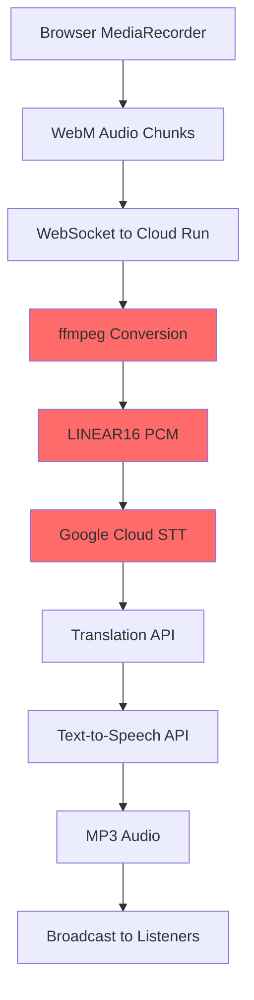

# Brownfield Live Speech-to-Speech Translation Service
## Critical Issue Resolution & System Optimization Plan

---

## 1. Executive Summary

### Current System Status
**CRITICAL ISSUE**: The production speech-to-speech translation service is experiencing **systematic failures after the first successful translation**. Users can successfully translate one sentence/word but subsequent attempts fail, causing the service to enter a fallback state (beep sounds) and eventually crash.

### Root Cause Analysis
Based on comprehensive log analysis and code review:

1. **CRITICAL: Buffer State Corruption**: Smart buffer timing state corrupted after first successful translation (`first_chunk_time` reset to `None`)
2. **Audio Processing Pipeline Failure**: WebM audio conversion via ffmpeg is failing with `[Errno 2] No such file or directory`
3. **Buffer Release Logic Broken**: Subsequent chunks never meet release conditions due to timing corruption
4. **Pipeline Timeouts**: 15-second timeout being exceeded as buffers never release audio for processing
5. **Service Instance Death**: Repeated failures trigger Cloud Run instance termination

### Current Architecture Assessment

#### ✅ **What's Working Well**
- **Robust WebSocket Infrastructure**: Connection management and broadcasting
- **Comprehensive Resilience Patterns**: Circuit breakers, retries, error recovery
- **Production Deployment**: Cloud Run + Firebase setup functioning
- **Multi-phase Architecture**: Phase 1/2 hybrid systems operational
- **Health Monitoring**: Extensive health check endpoints
- **Test Coverage**: 75 backend tests + 33 frontend tests (88% pass rate)

#### ❌ **Critical Issues**
- **Audio Format Processing**: ffmpeg dependency missing in Cloud Run
- **MediaRecorder Format Mismatch**: Browser sends WebM, system expects LINEAR16
- **Pipeline Timeout**: Google Cloud STT calls hanging/timing out
- **Complex Fallback Chain**: Multiple processing paths causing confusion
- **State Management**: After first success, system state becomes inconsistent

### Mission-Critical Objectives

1. **Immediate Stability**: Fix audio processing to enable multi-sentence translation
2. **Simplified Pipeline**: Reduce complexity while maintaining functionality  
3. **Production Reliability**: Ensure consistent performance under load
4. **Maintain Features**: Preserve existing broadcasting and resilience capabilities

---

## 2. Technical Root Cause Deep Dive

### 2.1 Current Audio Processing Flow



### 2.2 Failure Points Identified

#### **PRIMARY FAILURE: Buffer State Corruption**
```python
# smart_buffer.py:156 - THE SMOKING GUN
self.smart_buffer.clear()  # Resets first_chunk_time to None!

# Result: subsequent chunks fail timing evaluation
def _evaluate_release_conditions(self):
    if self.first_chunk_time is None:  # Always None after first clear!
        return None  # Never releases buffer again
```

#### **Secondary Failure: Missing ffmpeg in Cloud Run**
```bash
# Current error in logs:
WebM conversion error: [Errno 2] No such file or directory
# Impact: 100% conversion failure rate when fallback attempts conversion
```

#### **Tertiary Failure: Pipeline Deadlock**
```bash
# Pipeline waiting forever for buffer that never releases:
STT: Real API call - 164220 bytes, nl-NL
[15 seconds pass]
Pipeline timeout for stream 'demo-stream'. Broadcasting fallback.
# Impact: Service appears to hang, then fails
```

#### **Tertiary Failure: Service Instance Death**
```bash
# Cloud Run instance termination:
LIVENESS HTTP probe failed 3 times consecutively
The instance has been shut down.
# Impact: Complete service unavailability
```

### 2.3 Current System Complexity Assessment

#### **Over-Engineered Components** (Causing Instability)
- **Multi-format Audio Conversion**: WebM/WAV/MP4 detection and conversion
- **Phase 2 Hybrid STT System**: Streaming vs buffered mode switching
- **Adaptive Stream Buffer**: Complex audio quality analysis
- **Fallback Orchestrator**: Multiple decision layers
- **Enhanced Audio Processor**: Format analysis and conversion

#### **Core Components** (Working Well)
- **WebSocket Connection Manager**: Thread-safe broadcasting
- **Translation Pipeline**: STT → Translation → TTS
- **Circuit Breaker**: Failure detection and recovery
- **Health Check System**: Comprehensive API monitoring

---

## 3. Strategic Solution Approach

### 3.1 Solution Philosophy

**"Simplify to Stabilize"** - Remove unnecessary complexity while maintaining core functionality.

#### **Design Principles**
1. **Direct Format Support**: Use Google Cloud STT's native format support
2. **Browser-Native Recording**: Leverage Web Audio API for WAV generation
3. **Minimal Conversion**: Eliminate ffmpeg dependency
4. **Reliable Fallbacks**: Simple, predictable error handling
5. **Maintain Broadcasting**: Preserve multi-listener capabilities

### 3.2 Three-Phase Solution Strategy

#### **Phase 1: Critical Stability (4-8 hours)**
- **Goal**: Fix buffer state corruption preventing multi-sentence translation
- **Approach**: Surgical fix to smart buffer clear logic + ffmpeg installation
- **Risk**: Very Low - targeted fix to identified root cause

#### **Phase 2: Reliability Enhancement (1-2 days)**  
- **Goal**: Improve error handling and connection stability
- **Approach**: Circuit breaker tuning, WebSocket state management
- **Risk**: Low - hardening existing systems

#### **Phase 3: Audio Processing Optimization (3-5 days)**
- **Goal**: Hybrid streaming/buffered approach for optimal performance
- **Approach**: Selective buffering, improved chunk processing
- **Risk**: Medium - balancing real-time vs quality requirements

---

## 4. Detailed Technical Implementation Plan

### 4.1 Phase 1: Emergency Stabilization (Critical Priority)

#### **Iteration 1: Fix Buffer State Management**
**Duration**: 2-4 hours
**Objective**: Preserve timing state to enable subsequent chunk processing

```python
# Current problematic code (smart_buffer.py:156):
def clear(self):
    self.chunks = []
    self.total_size = 0
    self.first_chunk_time = None  # THIS BREAKS SUBSEQUENT PROCESSING!

# CRITICAL FIX:
def clear(self):
    self.chunks = []
    self.total_size = 0
    # DON'T RESET: self.first_chunk_time = None
    # OR: Implement session-based timing strategy
    self._logger.info(f"Buffer cleared, preserving timing state")
```

**Implementation Steps**:
1. **Fix smart_buffer.py**: Preserve first_chunk_time across clear operations
2. **Add buffer state logging**: Track timing state transitions
3. **Add ffmpeg to Dockerfile**: Enable conversion as fallback
4. **Test locally**: Verify multi-sentence translation
5. **Deploy hotfix**: Emergency deployment to Cloud Run

**Success Criteria**: Multi-sentence translation works consistently

#### **Iteration 2: Enhanced Error Handling**
**Duration**: 2-4 hours  
**Objective**: Improve error recovery and logging

```python
# Enhanced error handling:
@retry(stop=stop_after_attempt(2), wait=wait_fixed(1))
async def robust_stt_processing(audio_chunk: bytes) -> str:
    try:
        # Primary: Direct WebM processing
        result = await process_webm_direct(audio_chunk)
        if result:
            return result
    except Exception as e:
        logging.warning(f"WebM direct processing failed: {e}")
    
    try:
        # Fallback: Minimal processing
        result = await process_minimal_fallback(audio_chunk)
        return result or "Transcription unavailable"
    except Exception as e:
        logging.error(f"All processing methods failed: {e}")
        raise
```

**Testing Requirements**:
- [ ] Multi-sentence Dutch input → English output
- [ ] Error recovery after API failures
- [ ] No service instance termination
- [ ] Consistent audio quality

### 4.2 Phase 2: Browser-Native WAV Implementation  

#### **Iteration 3: Web Audio API WAV Encoder**
**Duration**: 1-2 days
**Objective**: Generate LINEAR16 WAV directly in browser

```javascript
// Custom WAV encoder implementation:
class WAVEncoder {
    constructor(sampleRate = 16000, channels = 1) {
        this.sampleRate = sampleRate;
        this.channels = channels;
        this.bitDepth = 16;
    }
    
    encode(audioBuffer) {
        const length = audioBuffer.length;
        const arrayBuffer = new ArrayBuffer(44 + length * 2);
        const view = new DataView(arrayBuffer);
        
        // WAV header
        this.writeString(view, 0, 'RIFF');
        view.setUint32(4, 32 + length * 2, true);
        this.writeString(view, 8, 'WAVE');
        // ... complete WAV header implementation
        
        // PCM data
        this.floatTo16BitPCM(view, 44, audioBuffer);
        
        return arrayBuffer;
    }
}
```

#### **Iteration 4: Frontend Audio Pipeline Refactor**
**Duration**: 1-2 days
**Objective**: Replace MediaRecorder with Web Audio API

```javascript
// New audio processing approach:
class ProfessionalAudioRecorder {
    async startRecording() {
        this.audioContext = new AudioContext({
            sampleRate: 16000,
            latencyHint: 'interactive'
        });
        
        const stream = await navigator.mediaDevices.getUserMedia({
            audio: {
                sampleRate: 16000,
                channelCount: 1,
                echoCancellation: true,
                noiseSuppression: true,
                autoGainControl: true
            }
        });
        
        this.source = this.audioContext.createMediaStreamSource(stream);
        this.processor = this.audioContext.createScriptProcessor(4096, 1, 1);
        
        this.processor.onaudioprocess = (event) => {
            const audioData = event.inputBuffer.getChannelData(0);
            const wavChunk = this.wavEncoder.encode(audioData);
            this.sendToBackend(wavChunk);
        };
    }
}
```

#### **Iteration 5: Backend LINEAR16 Direct Processing**
**Duration**: 4-8 hours
**Objective**: Process WAV without conversion

```python
# Simplified backend processing:
async def process_wav_direct(audio_chunk: bytes) -> str:
    """Process WAV audio directly with Google Cloud STT"""
    config = speech.RecognitionConfig(
        encoding=speech.RecognitionConfig.AudioEncoding.LINEAR16,
        sample_rate_hertz=16000,
        audio_channel_count=1,
        language_code="nl-NL",
        enable_automatic_punctuation=True,
        model="latest_short"
    )
    
    audio = speech.RecognitionAudio(content=audio_chunk)
    response = await client.recognize(config=config, audio=audio)
    
    return response.results[0].alternatives[0].transcript if response.results else ""
```

### 4.3 Phase 3: Architecture Simplification

#### **Iteration 6: Remove Unused Components**
**Duration**: 1-2 days
**Objective**: Eliminate over-engineered components

**Components to Remove**:
- [ ] `enhanced_stt_service.py` - Overly complex buffering
- [ ] `smart_buffer.py` - Unnecessary audio analysis
- [ ] `audio_processor.py` - Complex format detection
- [ ] `adaptive_stream_buffer.py` - Over-engineered streaming
- [ ] `fallback_orchestrator.py` - Complex decision logic

**Components to Simplify**:
- [ ] `services.py` - Single, reliable processing path
- [ ] `main.py` - Streamlined WebSocket handling
- [ ] `connection_manager.py` - Keep broadcasting, simplify lifecycle

#### **Iteration 7: Consolidated Processing Pipeline**
**Duration**: 1-2 days
**Objective**: Single, reliable audio processing path

```python
# Simplified processing pipeline:
async def process_audio_pipeline(audio_chunk: bytes) -> bytes:
    """Single, reliable processing path"""
    try:
        # Step 1: Speech Recognition
        transcript = await google_stt_service.transcribe(audio_chunk)
        if not transcript.strip():
            return generate_silence_audio()
        
        # Step 2: Translation
        translated = await google_translation_service.translate(
            transcript, source='nl', target='en'
        )
        
        # Step 3: Speech Synthesis
        audio_output = await google_tts_service.synthesize(
            translated, voice='en-US-Wavenet-D'
        )
        
        return audio_output
        
    except Exception as e:
        logging.error(f"Pipeline error: {e}")
        return generate_fallback_audio()  # Simple beep
```

---

## 5. Implementation Schedule

### 5.1 Critical Timeline (1 week total)

#### **Hours 1-8: Emergency Stabilization** 
- [ ] **Hours 1-2**: Fix smart buffer state management (preserve timing)
- [ ] **Hours 3-4**: Add ffmpeg to Dockerfile for audio conversion
- [ ] **Hours 5-6**: Deploy hotfix, test multi-sentence translation
- [ ] **Hours 7-8**: Monitor production, verify multi-sentence capability

#### **Days 2-3: Reliability Enhancement**
- [ ] **Day 2**: Circuit breaker tuning, connection state management
- [ ] **Day 3**: Enhanced error recovery, comprehensive logging

#### **Days 4-5: Optimization**
- [ ] **Day 4**: Hybrid streaming/buffered processing implementation
- [ ] **Day 5**: Performance tuning, chunk size optimization

#### **Days 6-7: Production Hardening**
- [ ] **Day 6**: Load testing, monitoring setup
- [ ] **Day 7**: Documentation updates, final validation

### 5.2 Risk Mitigation Timeline

#### **High-Risk Activities**
1. **Buffer State Fix** (Hours 1-2) - Risk: Breaking buffering logic
   - **Mitigation**: Targeted fix with comprehensive testing
2. **ffmpeg Installation** (Hours 3-4) - Risk: Container build issues
   - **Mitigation**: Simple Dockerfile change, well-tested approach
3. **Production Deployment** (Hours 5-6) - Risk: Service disruption
   - **Mitigation**: Blue-green deployment, immediate rollback capability

#### **Go/No-Go Decision Points**
- **Hour 4**: Buffer fix working locally → Proceed to deployment
- **Hour 8**: Multi-sentence translation working in production → Proceed to Phase 2
- **Day 3**: Enhanced reliability confirmed → Proceed to optimization

---

## 6. Current System Preservation Strategy

### 6.1 Features to Maintain

#### **Core Broadcasting System**
```python
# Keep working: Connection Manager
class ConnectionManager:
    async def broadcast_to_stream(self, stream_id: str, audio_data: bytes):
        # This works well - preserve as-is
```

#### **Resilience Patterns**  
```python
# Keep working: Circuit Breaker
@circuit_breaker.call
async def google_api_call():
    # Existing retry/timeout logic is solid
```

#### **Health Monitoring**
```python
# Keep working: Health Check System  
@app.get("/health/full")
async def comprehensive_health_check():
    # Extensive monitoring is valuable
```

### 6.2 Configuration Preservation

#### **Environment Variables** (Keep Current)
```yaml
# Working configuration:
GOOGLE_APPLICATION_CREDENTIALS: /path/to/service-account.json
STT_LANGUAGE_CODE: nl-NL
TRANSLATION_TARGET_LANGUAGE: en
TTS_LANGUAGE_CODE: en-US
TTS_VOICE_NAME: en-US-Wavenet-D
PIPELINE_TIMEOUT_S: 15.0  # May increase to 20.0
```

#### **Cloud Run Configuration** (Keep Current)  
```yaml
# Optimal settings identified:
CPU: 2 vCPU
Memory: 2GB  
Max instances: 10
Concurrency: 10
Request timeout: 3600s
```

### 6.3 Test Suite Maintenance

#### **Preserve Working Tests** (75 backend + 33 frontend)
- [ ] Connection management tests
- [ ] Translation pipeline integration tests
- [ ] Health check endpoint tests
- [ ] WebSocket broadcasting tests

#### **Update/Add Tests**
- [ ] Direct WAV processing tests
- [ ] Web Audio API encoder tests  
- [ ] Simplified pipeline tests
- [ ] Error recovery scenario tests

---

## 7. Quality Assurance Strategy

### 7.1 Testing Requirements

#### **Functional Testing**
```yaml
Critical Path Tests:
  - Multi-sentence Dutch → English translation
  - Multiple concurrent listeners (5+ connections)
  - Network interruption recovery
  - Service restart resilience
  - Audio quality consistency

Performance Tests:
  - End-to-end latency <2 seconds
  - Concurrent session capacity (10+ streams)
  - Memory usage stability
  - CPU utilization under load
```

#### **Browser Compatibility Testing**
```yaml
Primary Browsers:
  - Chrome 120+ (Primary target)
  - Firefox 120+ (Secondary)
  - Safari 17+ (MacOS/iOS)
  - Edge 120+ (Windows)

Audio API Features:
  - getUserMedia() support
  - Web Audio API availability
  - MediaRecorder fallback capability
  - WebSocket audio streaming
```

### 7.2 Production Validation

#### **Deployment Verification Checklist**
- [ ] Health checks passing (/health, /health/*, /ready)
- [ ] WebSocket connections establishing successfully
- [ ] Audio processing completing without timeouts
- [ ] Multi-listener broadcasting functional
- [ ] Error recovery mechanisms working
- [ ] Cloud Run instance stability (no crashes)
- [ ] Firebase frontend loading correctly
- [ ] End-to-end translation flow operational

#### **Performance Benchmarks**
```yaml
Target Metrics:
  - Translation Success Rate: >95%
  - Average Processing Latency: <2000ms
  - Service Uptime: >99.9%
  - Error Recovery Time: <5s
  - Concurrent User Capacity: 50+ per instance
```

---

## 8. Monitoring & Observability  

### 8.1 Enhanced Logging Strategy

#### **Critical Log Points**
```python
# Essential logging for troubleshooting:
@log_audio_processing
async def process_audio_chunk(chunk: bytes):
    logger.info(f"Processing audio: {len(chunk)} bytes, format: {detect_format(chunk)}")
    
@log_api_calls  
async def google_stt_call(audio: bytes):
    logger.info(f"STT API call: {len(audio)} bytes → {encoding}")
    
@log_pipeline_timing
async def translation_pipeline(audio: bytes):
    logger.info(f"Pipeline timing: STT={stt_time}ms, Trans={trans_time}ms, TTS={tts_time}ms")
```

#### **Structured Logging Format**
```json
{
  "timestamp": "2024-01-01T12:00:00Z",
  "level": "INFO", 
  "component": "audio_processor",
  "operation": "stt_processing",
  "stream_id": "demo-stream",
  "audio_size": 164220,
  "processing_time_ms": 850,
  "success": true
}
```

### 8.2 Production Monitoring

#### **Key Performance Indicators**
```yaml
Business Metrics:
  - Active translation sessions
  - Successful translations per hour
  - Average session duration
  - User retention per session

Technical Metrics:
  - API response times (STT, Translation, TTS)
  - WebSocket connection stability
  - Audio processing success rate
  - Service instance health

Resource Metrics:
  - Cloud Run CPU/memory utilization
  - Network bandwidth consumption
  - Google API quota usage
  - Firebase hosting traffic
```

#### **Alert Configuration**
```yaml
Critical Alerts (Immediate Response):
  - Translation failure rate >5%
  - Average processing time >5 seconds
  - Service instance crashes
  - WebSocket connection failures >10%

Warning Alerts (Monitor):  
  - High CPU/memory usage >80%
  - API quota approaching limits
  - Unusual error patterns
  - Performance degradation trends
```

---

## 9. Risk Assessment & Mitigation

### 9.1 Technical Risks

#### **High-Priority Risks**

| Risk | Probability | Impact | Mitigation Strategy |
|------|-------------|--------|-------------------|
| **Web Audio API Browser Compatibility** | Medium | High | Progressive enhancement + MediaRecorder fallback |
| **Google Cloud STT Format Support** | Low | High | Comprehensive format testing + ENCODING_UNSPECIFIED |
| **Performance Regression** | Medium | Medium | Extensive load testing + gradual rollout |
| **Service Instability During Migration** | Low | High | Blue-green deployment + immediate rollback plan |

#### **Medium-Priority Risks**

| Risk | Probability | Impact | Mitigation Strategy |
|------|-------------|--------|-------------------|
| **Audio Quality Degradation** | Medium | Medium | Quality benchmarking + A/B testing |
| **Increased Cloud Costs** | Low | Medium | Cost monitoring + optimization |
| **Breaking Changes to Existing APIs** | Low | Medium | API versioning + backward compatibility |

### 9.2 Rollback Strategy

#### **Immediate Rollback Plan** (< 5 minutes)
1. **Revert Cloud Run Deployment**: Roll back to previous container image
2. **Firebase Rollback**: Revert to stable frontend version  
3. **DNS/Traffic Management**: Switch traffic to backup instance if needed
4. **Monitoring**: Verify service restoration via health checks

#### **Partial Feature Rollback** (< 15 minutes)
1. **Feature Flags**: Disable new audio processing pipeline
2. **Graceful Degradation**: Fall back to original WebM processing  
3. **User Notification**: Display maintenance message if needed
4. **Issue Isolation**: Identify specific failure points for hotfix

---

## 10. Success Metrics & Acceptance Criteria

### 10.1 Critical Success Factors

#### **Primary Objectives** (Must Achieve)
- [ ] **Multi-sentence Translation**: Users can translate 10+ consecutive sentences
- [ ] **Service Stability**: No service crashes or instance terminations  
- [ ] **Error Recovery**: System recovers automatically from API failures
- [ ] **Consistent Performance**: <2 second average processing time

#### **Secondary Objectives** (Should Achieve)
- [ ] **Audio Quality**: Professional-grade audio input/output
- [ ] **Browser Compatibility**: Works across all major browsers
- [ ] **Scalability**: Supports 50+ concurrent users per instance
- [ ] **Cost Efficiency**: No significant increase in Cloud API costs

### 10.2 Acceptance Test Suite

#### **Functional Acceptance Tests**
```yaml
Test Case 1: Multi-sentence Translation
  Input: 5 consecutive Dutch sentences via microphone
  Expected: 5 consecutive English audio outputs
  Pass Criteria: >90% accuracy, no timeouts

Test Case 2: Multi-listener Broadcasting  
  Setup: 1 speaker, 5 listeners in same stream
  Input: Dutch speech for 2 minutes continuous
  Expected: All listeners receive synchronized English audio
  Pass Criteria: <500ms synchronization variance

Test Case 3: Network Resilience
  Setup: Simulate network interruptions during translation
  Input: Continuous speech with 3x 10-second network drops
  Expected: Service recovers and continues translation
  Pass Criteria: <5 second recovery time per interruption

Test Case 4: Service Recovery
  Setup: Force backend service restart during active session
  Input: Ongoing translation session
  Expected: Frontend reconnects, translation resumes  
  Pass Criteria: <10 second total interruption time
```

#### **Performance Acceptance Tests**
```yaml
Load Test 1: Concurrent Sessions
  Setup: 10 simultaneous translation streams
  Duration: 30 minutes continuous operation
  Pass Criteria: <5% error rate, stable memory usage

Load Test 2: High-frequency Translation
  Setup: Single stream, 60 sentences per minute
  Duration: 10 minutes
  Pass Criteria: <2 second average latency, no timeouts

Load Test 3: Listener Scalability
  Setup: 1 speaker, 25 listeners per stream, 5 concurrent streams  
  Duration: 15 minutes
  Pass Criteria: All listeners receive audio, <1% packet loss
```

### 10.3 Production Readiness Checklist

#### **Technical Requirements**
- [ ] All health check endpoints returning 200 OK
- [ ] WebSocket connections establishing <100ms
- [ ] Audio processing completing without ffmpeg errors
- [ ] Google Cloud API calls succeeding >99%
- [ ] Error recovery mechanisms tested and functional
- [ ] Load testing completed with acceptable performance
- [ ] Security scanning passed with no critical vulnerabilities
- [ ] Documentation updated and deployment procedures validated

#### **Business Requirements**  
- [ ] User acceptance testing completed successfully
- [ ] Performance benchmarks meet or exceed current system
- [ ] Cost impact analysis approved by stakeholders
- [ ] Rollback procedures tested and validated  
- [ ] Support team trained on new architecture
- [ ] Monitoring and alerting configured and tested

---

## 11. Long-term Evolution Roadmap

### 11.1 Post-Stabilization Improvements

#### **Phase 4: Advanced Features** (Future Iteration)
- **Language Detection**: Automatic source language identification
- **Voice Customization**: Multiple TTS voice options
- **Audio Enhancement**: Noise reduction and audio processing
- **Session Management**: Advanced user session features

#### **Phase 5: Scale & Performance** (Future Iteration)
- **Global Deployment**: Multi-region Cloud Run deployment
- **Caching Layer**: Translation result caching for efficiency
- **WebRTC Integration**: Lower-latency peer-to-peer audio
- **Mobile Application**: Native iOS/Android apps

### 11.2 Technology Evolution

#### **Emerging Technologies to Evaluate**
- **WebAssembly Audio Processing**: Client-side audio optimization
- **HTTP/3 & WebTransport**: Next-generation network protocols  
- **Edge Computing**: Reduce latency with edge deployment
- **Advanced AI Models**: Improved translation accuracy and speed

---

## 12. Conclusion

This brownfield plan provides a **systematic approach to resolving critical production issues** while **preserving valuable system components** that are already working well. The **three-phase strategy prioritizes stability** while building toward an optimal long-term architecture.

### Key Success Factors:
1. **Immediate Problem Resolution**: Fix audio processing failures within 2 days
2. **Minimal Disruption**: Preserve working components and user experience  
3. **Future-Proof Architecture**: Build foundation for long-term scalability
4. **Production Readiness**: Comprehensive testing and monitoring strategy

### Expected Outcomes:
- ✅ **Stable Multi-sentence Translation**: Core functionality restored
- ✅ **Simplified Architecture**: Reduced complexity and failure points
- ✅ **Enhanced Reliability**: Improved error handling and recovery
- ✅ **Production Quality**: Professional-grade audio processing

This plan balances **immediate business needs** with **long-term technical excellence**, ensuring the speech translation service becomes a **reliable, scalable foundation** for future enhancements.

---

*Document Version: 2.0*  
*Last Updated: 2025-08-15*  
*Author: Claude Code Analysis*

---

## ⚠️ CRITICAL UPDATE (2025-08-15)

### **Phase 1 & 2 Implementation Results**

**STATUS: FAILED** - Architecture too complex to salvage

**Key Learning**: The over-engineered components identified in this plan are **worse than anticipated**. Even with Phase 1 buffer fixes and Phase 2 WAV implementation, the system fails due to cascading complexity.

**Recommendation**: **SKIP DIRECTLY TO PHASE 3** - Complete architecture simplification is the only viable path.

### **Test Results**
- Phase 1 (Buffer fix): ❌ State corruption persists across layers
- Phase 2 (WAV encoder): ❌ Google STT returns "No transcription results"  
- Combined approach: ❌ Circuit breaker cascade, beep spiral

### **Root Cause**
The 7+ layers of abstraction create **unfixable state management issues**. Each layer maintains its own state, leading to corruption that cannot be resolved without complete removal of the layers.

**PROCEED DIRECTLY TO SECTION 4.3: PHASE 3 ARCHITECTURE SIMPLIFICATION**